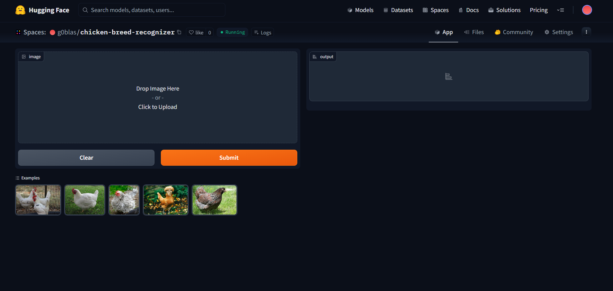
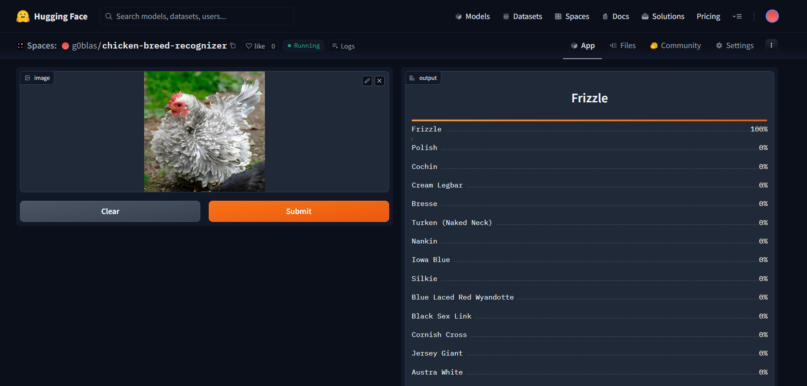

# chicken-breeds-recognizer
An image classification model from data collection (scraping chicken types), cleaning, model training, deployment and API integration.  
The model can classify 20 different types of chicken breeds  
The types are following:  
1. Austra White
2. Black Sex Link beanie cap
3. Blue Laced Red Wyandotte
4. Bresse
5. Cherry Egger
6. Cochin
7. Cornish Cross
8. Cream Legbar
9. Easter Egger
10. Frizzle
11. Iowa Blue
12. Jersey Giant
13. Nankin
14. New Hampshire
15. Orpingtons
16. Polish
17. Shamo
18. Silkie
19. Silver Laced Wyandotte
20. Turken (Naked Neck)

# Dataset preparations
**Data Scraping**: Collected the names of the chicken breeds through web scraping from this [link](https://www.chickensandmore.com/chicken-breeds). 
**Data Collection**: Downloaded from DuckDuckgo using term name.
**Dataloader**: Used fastai DataBlock API to set up the Dataloader.
Data Augmentation: fastai provides default data augmentation which operates in GPU.  
Details can be found in **.ipynb** format in `notebooks/chicken_breed_recognizer_data_collections.ipynb` also in **.py** format in `src/chicken_breed_recognizer_data_collections.py`

# Training and Data Cleaning
**Training**: Fine-tuned a resnet34 model 3 times, for (10+10+5) epochs and got up to ~**94%** accuracy.  
**Data Cleaning**: This part was the most tedious and took the highest time. Since the data was collected from DuckDuckgo images, there were many noises, and also misguided images. Cleaned and updated data using fastai ImageClassifierCleaner. A visual tool for cleaning data. I cleaned the data each time after training/finetuning, except for the last time which was the final iteration of the model.  

# Deployment
Deployed the model to HuggingFace Spaces Gradio App. The implementation can be found in `app` folder or [here](https://huggingface.co/spaces/g0blas/chicken-breed-recognizer) 
 

# API integration with github pages
The deployed model API is intgegrated [here]() in github pages website. Implementation can be found in `docs` folder.